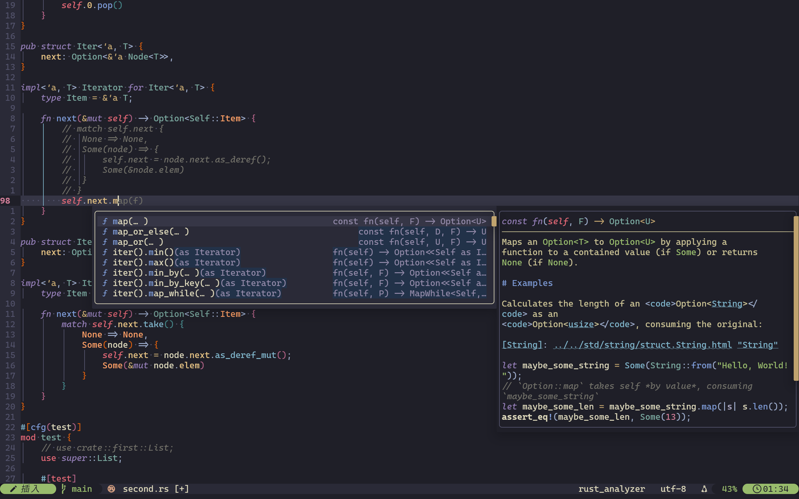

## Powered by `Neovim` v0.12 & `vim.pack`. Designed for speed and aesthetics.



## 环境依赖
1. 编译器: gcc, g++
2. Rust 工具链: rustc, cargo
3. tree-sitter-cli: 确保语法高亮解析正常

```test
├── after
│   └── lsp
│       └── lua_ls.lua
├── init.lua
├── lua
│   ├── config
│   │   ├── autocmd.lua
│   │   ├── globals.lua
│   │   ├── init.lua
│   │   ├── keymap.lua
│   │   ├── lsp.lua
│   │   ├── neovide.lua
│   │   └── options.lua
│   ├── plugins
│   │   ├── blink-cmp.lua
│   │   ├── blink-pairs.lua
│   │   ├── conform.lua
│   │   ├── gitsigns.lua
│   │   ├── init.lua
│   │   ├── lualine.lua
│   │   ├── mini-files.lua
│   │   ├── mini-indentscope.lua
│   │   ├── mini-surround.lua
│   │   ├── multicursor-nvim.lua
│   │   ├── nvim-treesitter.lua
│   │   ├── oil.lua
│   │   ├── render-markdown.lua
│   │   ├── telescope.lua
│   │   ├── themes.lua
│   │   └── tiny-inline-diagnostics.lua
│   └── utlis
│       └── builder.lua
├── nvim-pack-lock.json
└── snippets
    ├── cpp.json
    ├── json.json
    ├── lua.json
    └── package.json
